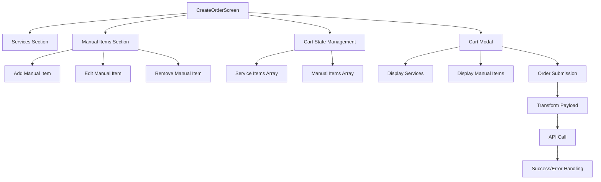
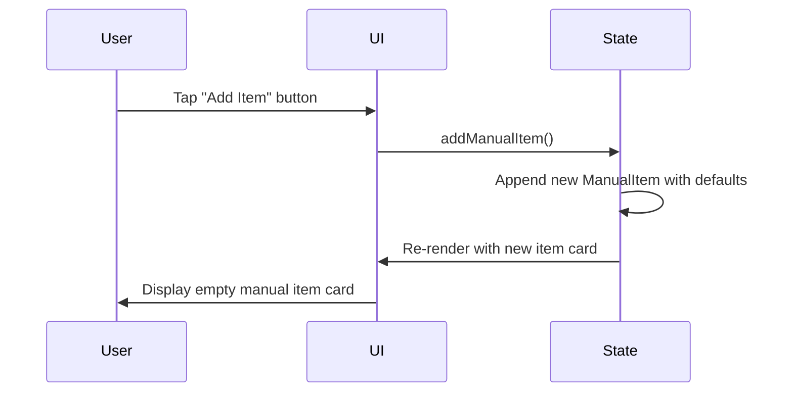
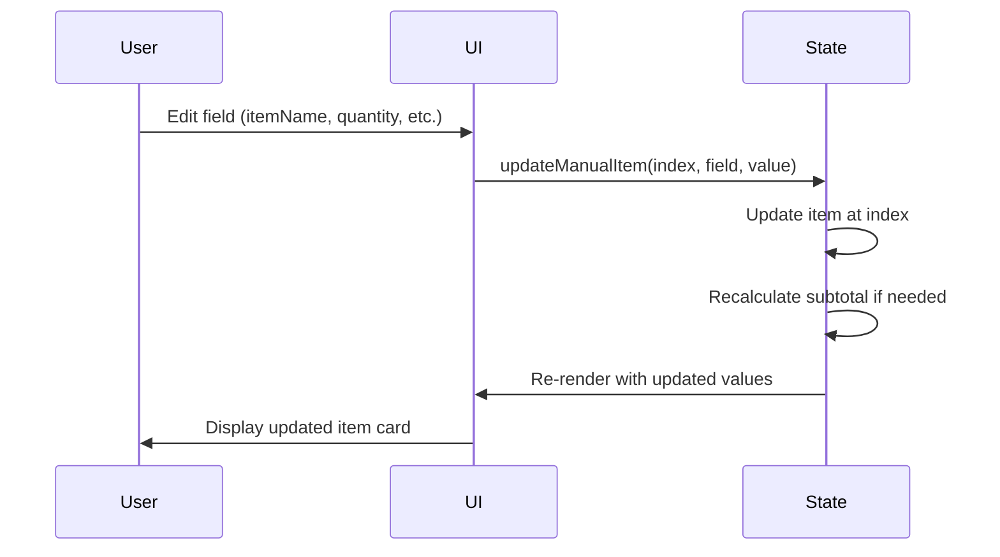
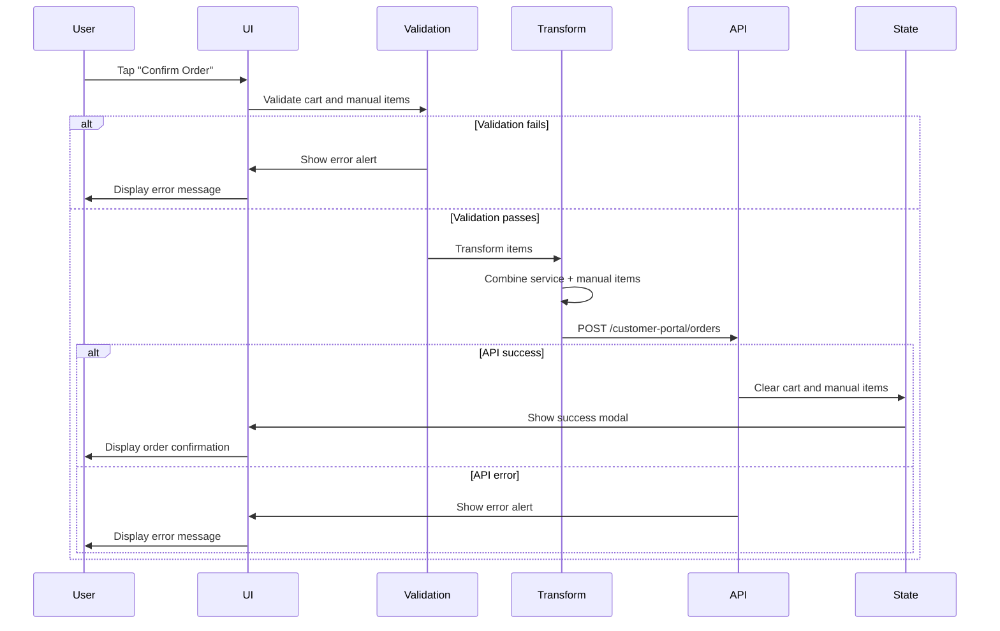

# Design Document: Mobile APK Manual Items Feature

## Overview

This document specifies the technical design for adding Manual Items functionality to the React Native mobile application (APK) for the laundry management system. The feature enables mobile users to add non-billable items (bedsheet, towel, shirt, cover, etc.) to orders for damage tracking purposes, achieving feature parity with the existing web application.

### Purpose

Manual items serve as a damage tracking mechanism, allowing customers to document items received at pickup time. These items are NOT billed to customers (serviceType: 'manual') but are tracked throughout the order lifecycle for insurance and accountability purposes.

### Scope

- Add Manual Items section to CreateOrderScreen
- Implement state management for manual items array
- Create UI components for adding, editing, and removing manual items
- Integrate manual items into cart modal display
- Transform manual items for order submission payload
- Implement validation logic for manual items
- Ensure cross-platform compatibility (Android & iOS)

### Out of Scope

- Backend API modifications (existing /customer-portal/orders endpoint already supports manual items)
- Manual items editing after order submission
- Manual items damage tracking workflow (handled in separate admin features)

## Architecture

### High-Level Architecture



### Component Hierarchy

```
CreateOrderScreen
├── Header
├── ScrollView
│   ├── Services Section (existing)
│   │   └── Service Cards
│   ├── Manual Items Section (NEW)
│   │   ├── Section Header
│   │   ├── Add Item Button
│   │   └── Manual Item Cards
│   │       ├── Item Type Selector
│   │       ├── Item Name Input
│   │       ├── Quantity Input
│   │       ├── Price Input
│   │       ├── Subtotal Display
│   │       └── Remove Button
│   └── Special Instructions (existing)
├── Floating Cart Button (existing)
└── Cart Modal (existing, enhanced)
    ├── Services List
    ├── Manual Items List (NEW)
    ├── Payment Method
    ├── Total Summary
    └── Confirm Order Button
```

## Components and Interfaces

### State Management

#### New State Variables

```typescript
// Add to CreateOrderScreen component state
const [manualItems, setManualItems] = useState<ManualItem[]>([]);

interface ManualItem {
    itemType: 'Clothing' | 'Linen' | 'Accessories' | 'Special_Items';
    itemName: string;
    quantity: number;
    pricePerUnit: number;
    subtotal: number;
}
```

#### State Update Functions

```typescript
// Add manual item with default values
const addManualItem = () => {
    setManualItems([...manualItems, {
        itemType: 'Clothing',
        itemName: '',
        quantity: 1,
        pricePerUnit: 0,
        subtotal: 0,
    }]);
};

// Update manual item field
const updateManualItem = (index: number, field: keyof ManualItem, value: any) => {
    setManualItems(manualItems.map((item, i) => {
        if (i !== index) return item;
        const updated = { ...item, [field]: value };
        // Recalculate subtotal when quantity or price changes
        if (field === 'quantity' || field === 'pricePerUnit') {
            updated.subtotal = updated.quantity * updated.pricePerUnit;
        }
        return updated;
    }));
};

// Remove manual item
const removeManualItem = (index: number) => {
    setManualItems(manualItems.filter((_, i) => i !== index));
};
```

### UI Components

#### Manual Items Section Component

**Location:** Within CreateOrderScreen ScrollView, after Services Section

**Structure:**
```tsx
<View style={styles.manualItemsSection}>
    {/* Section Header */}
    <View style={styles.sectionHeader}>
        <Text style={styles.sectionTitle}>Add Items (Bedsheet, Towel, etc.)</Text>
        <TouchableOpacity onPress={addManualItem} style={styles.addButton}>
            <LinearGradient
                colors={['#06b6d4', '#0284c7']}
                start={{ x: 0, y: 0 }}
                end={{ x: 1, y: 0 }}
                style={styles.addButtonGradient}
            >
                <Text style={styles.addButtonIcon}>+</Text>
                <Text style={styles.addButtonText}>Add Item</Text>
            </LinearGradient>
        </TouchableOpacity>
    </View>

    {/* Empty State or Item Cards */}
    {manualItems.length === 0 ? (
        <Text style={styles.emptyText}>
            No items added. Click "Add Item" to add bedsheet, towel, etc.
        </Text>
    ) : (
        manualItems.map((item, index) => (
            <ManualItemCard
                key={index}
                item={item}
                index={index}
                onUpdate={updateManualItem}
                onRemove={removeManualItem}
            />
        ))
    )}
</View>
```

#### Manual Item Card Component

**Props:**
```typescript
interface ManualItemCardProps {
    item: ManualItem;
    index: number;
    onUpdate: (index: number, field: keyof ManualItem, value: any) => void;
    onRemove: (index: number) => void;
}
```

**Structure:**
```tsx
<View style={styles.manualItemCard}>
    {/* Row 1: Item Type & Item Name */}
    <View style={styles.row}>
        <View style={styles.halfWidth}>
            <Text style={styles.label}>Item Type</Text>
            <Picker
                selectedValue={item.itemType}
                onValueChange={(value) => onUpdate(index, 'itemType', value)}
                style={styles.picker}
            >
                <Picker.Item label="👕 Clothing" value="Clothing" />
                <Picker.Item label="🛏️ Linen" value="Linen" />
                <Picker.Item label="👜 Accessories" value="Accessories" />
                <Picker.Item label="⭐ Special Items" value="Special_Items" />
            </Picker>
        </View>
        <View style={styles.halfWidth}>
            <Text style={styles.label}>Item Name</Text>
            <TextInput
                value={item.itemName}
                onChangeText={(text) => onUpdate(index, 'itemName', text)}
                placeholder="e.g., Bedsheet, Towel, Shirt"
                placeholderTextColor="#475569"
                style={styles.textInput}
            />
        </View>
    </View>

    {/* Row 2: Quantity, Price, Subtotal, Remove */}
    <View style={styles.row}>
        <View style={styles.thirdWidth}>
            <Text style={styles.label}>Quantity</Text>
            <TextInput
                value={String(item.quantity)}
                onChangeText={(text) => {
                    const qty = parseInt(text) || 1;
                    onUpdate(index, 'quantity', Math.max(1, qty));
                }}
                keyboardType="numeric"
                style={styles.numericInput}
            />
        </View>
        <View style={styles.thirdWidth}>
            <Text style={styles.label}>Price per Item</Text>
            <TextInput
                value={String(item.pricePerUnit)}
                onChangeText={(text) => {
                    const price = parseFloat(text) || 0;
                    onUpdate(index, 'pricePerUnit', Math.max(0, price));
                }}
                keyboardType="decimal-pad"
                style={styles.numericInput}
            />
        </View>
        <View style={styles.thirdWidth}>
            <Text style={styles.label}>Subtotal</Text>
            <View style={styles.subtotalContainer}>
                <Text style={styles.subtotalText}>${item.subtotal}</Text>
                <TouchableOpacity
                    onPress={() => onRemove(index)}
                    style={styles.removeButton}
                >
                    <Text style={styles.removeIcon}>🗑️</Text>
                </TouchableOpacity>
            </View>
        </View>
    </View>
</View>
```

#### Cart Modal Enhancement

**Manual Items Section in Cart:**
```tsx
{/* Manual Items Section */}
{manualItems.length > 0 && (
    <View style={styles.cartSection}>
        <Text style={styles.cartSectionTitle}>Items</Text>
        <Text style={styles.trackingNote}>
            For tracking only - not billed
        </Text>
        {manualItems.map((item, index) => (
            <View key={index} style={styles.manualCartItem}>
                <View style={styles.itemHeader}>
                    <View style={styles.itemTypeBadge}>
                        <Text style={styles.itemTypeBadgeText}>
                            {item.itemType.replace('_', ' ')}
                        </Text>
                    </View>
                    <TouchableOpacity
                        onPress={() => removeManualItem(index)}
                        style={styles.removeCartButton}
                    >
                        <Text style={styles.removeText}>Remove</Text>
                    </TouchableOpacity>
                </View>
                <Text style={styles.itemName}>{item.itemName || 'Unnamed Item'}</Text>
                <Text style={styles.itemDetails}>
                    {item.quantity} × ${item.pricePerUnit} = ${item.subtotal}
                </Text>
            </View>
        ))}
    </View>
)}
```

## Data Models

### ManualItem Interface

```typescript
interface ManualItem {
    itemType: 'Clothing' | 'Linen' | 'Accessories' | 'Special_Items';
    itemName: string;
    quantity: number;
    pricePerUnit: number;
    subtotal: number;
}
```

### Order Submission Payload Transformation

```typescript
const placeOrder = async () => {
    // Validation
    if (cart.length === 0 && manualItems.length === 0) {
        Alert.alert('Empty Cart', 'Please add at least one service or item');
        return;
    }

    // Validate manual items
    for (const item of manualItems) {
        if (!item.itemName.trim()) {
            Alert.alert('Validation Error', 'Please provide item name for all manual items');
            return;
        }
        if (item.quantity < 1) {
            Alert.alert('Validation Error', 'Quantity must be at least 1 for all items');
            return;
        }
    }

    setSubmitting(true);
    try {
        // Transform service items
        const serviceItems = cart.map(c => ({
            serviceId: c.serviceId,
            quantity: c.quantity,
        }));

        // Transform manual items
        const transformedManualItems = manualItems.map(mi => ({
            service: null,
            serviceName: mi.itemName,
            serviceType: 'manual',
            itemType: mi.itemType,
            itemName: mi.itemName,
            quantity: mi.quantity,
            unit: 'piece',
            pricePerUnit: mi.pricePerUnit,
            subtotal: mi.subtotal,
        }));

        // Combine items
        const allItems = [...serviceItems, ...transformedManualItems];

        const res = await api.post('/customer-portal/orders', {
            items: allItems,
            specialInstructions: specialInstructions.trim() || undefined,
        });

        setLastOrderId(res.data.data.orderId || 'PENDING');
        setCart([]);
        setManualItems([]); // Clear manual items
        setSpecialInstructions('');
        setShowCart(false);
        setShowSuccess(true);
    } catch (err: any) {
        Alert.alert('Error', err.response?.data?.message || 'Failed to place order');
    } finally {
        setSubmitting(false);
    }
};
```

### Cart Count Calculation

```typescript
// Update cart count to include manual items
const getCartCount = () => {
    const serviceCount = cart.reduce((sum, c) => sum + c.quantity, 0);
    const manualCount = manualItems.reduce((sum, m) => sum + m.quantity, 0);
    return serviceCount + manualCount;
};

// Cart total remains service items only (manual items not billed)
const getCartTotal = () => cart.reduce((sum, c) => sum + (c.service.pricePerUnit * c.quantity), 0);
```

## Data Flow

### Add Manual Item Flow



### Update Manual Item Flow



### Order Submission Flow



## Error Handling

### Validation Errors

**Empty Cart Validation:**
```typescript
if (cart.length === 0 && manualItems.length === 0) {
    Alert.alert('Empty Cart', 'Please add at least one service or item');
    return;
}
```

**Manual Item Name Validation:**
```typescript
for (const item of manualItems) {
    if (!item.itemName.trim()) {
        Alert.alert('Validation Error', 'Please provide item name for all manual items');
        return;
    }
}
```

**Quantity Validation:**
```typescript
for (const item of manualItems) {
    if (item.quantity < 1) {
        Alert.alert('Validation Error', 'Quantity must be at least 1 for all items');
        return;
    }
}
```

### API Errors

**Network Error:**
```typescript
catch (err: any) {
    if (!err.response) {
        Alert.alert('Network Error', 'Failed to place order. Please check your connection.');
    } else {
        Alert.alert('Error', err.response?.data?.message || 'Failed to place order');
    }
}
```

**Server Error:**
```typescript
catch (err: any) {
    Alert.alert('Error', err.response?.data?.message || 'Failed to place order');
    console.error('Order submission error:', err);
    console.log('Manual items data:', manualItems); // Debug logging
}
```

### Input Validation

**Numeric Input Handling:**
```typescript
// Quantity input - ensure minimum value of 1
onChangeText={(text) => {
    const qty = parseInt(text) || 1;
    onUpdate(index, 'quantity', Math.max(1, qty));
}}

// Price input - ensure non-negative value
onChangeText={(text) => {
    const price = parseFloat(text) || 0;
    onUpdate(index, 'pricePerUnit', Math.max(0, price));
}}
```

## Testing Strategy

### Unit Tests

**State Management Tests:**
- Test `addManualItem()` adds item with correct defaults
- Test `updateManualItem()` updates correct field
- Test `updateManualItem()` recalculates subtotal when quantity/price changes
- Test `removeManualItem()` removes correct item
- Test `getCartCount()` includes manual items
- Test `getCartTotal()` excludes manual items

**Validation Tests:**
- Test empty cart validation
- Test empty itemName validation
- Test quantity < 1 validation
- Test numeric input parsing (quantity, price)

**Transformation Tests:**
- Test manual item payload transformation
- Test combined items array structure
- Test service=null for manual items
- Test serviceType='manual' for manual items

### Integration Tests

**UI Interaction Tests:**
- Test "Add Item" button creates new card
- Test item type selector updates state
- Test item name input updates state
- Test quantity input updates state and subtotal
- Test price input updates state and subtotal
- Test remove button removes item
- Test manual items appear in cart modal
- Test manual items included in order submission

**Cross-Platform Tests:**
- Test rendering on Android
- Test rendering on iOS
- Test keyboard types (numeric, decimal-pad)
- Test touch interactions on both platforms

### Manual Testing Checklist

- [ ] Add manual item creates card with defaults
- [ ] Item type selector shows all 4 options with emojis
- [ ] Item name input accepts text
- [ ] Quantity input accepts only positive integers
- [ ] Price input accepts decimal numbers
- [ ] Subtotal updates when quantity/price changes
- [ ] Remove button deletes item
- [ ] Empty state shows placeholder text
- [ ] Manual items appear in cart modal with emerald styling
- [ ] Manual items show "For tracking only - not billed" note
- [ ] Cart count includes manual items
- [ ] Cart total excludes manual items
- [ ] Order submission includes manual items in payload
- [ ] Validation prevents empty itemName submission
- [ ] Validation prevents quantity < 1 submission
- [ ] Success clears manual items from state
- [ ] Error preserves manual items in state
- [ ] Scrolling works with many manual items
- [ ] UI matches dark theme styling
- [ ] Works on Android
- [ ] Works on iOS

## Styling

### Color Palette (Dark Theme)

```typescript
const colors = {
    background: '#0f172a',      // Main background
    cardBackground: '#1e293b',  // Card background
    border: '#334155',          // Border color
    primaryText: '#f1f5f9',     // Primary text
    secondaryText: '#64748b',   // Secondary text/labels
    tertiaryText: '#94a3b8',    // Tertiary text
    accent: '#06b6d4',          // Accent color (cyan)
    accentDark: '#0284c7',      // Accent dark (blue)
    emerald: '#22c55e',         // Manual items indicator
    emeraldLight: '#10b981',    // Manual items light
    red: '#ef4444',             // Destructive actions
    inputBg: '#1e293b',         // Input background
    inputBorder: '#334155',     // Input border
    readOnlyBg: '#0f172a',      // Read-only field background
};
```

### StyleSheet

```typescript
const styles = StyleSheet.create({
    // Manual Items Section
    manualItemsSection: {
        marginBottom: 20,
    },
    sectionHeader: {
        paddingHorizontal: 20,
        marginBottom: 10,
        flexDirection: 'row',
        alignItems: 'center',
        justifyContent: 'space-between',
    },
    sectionTitle: {
        color: colors.primaryText,
        fontSize: 16,
        fontWeight: '700',
    },
    addButton: {
        borderRadius: 10,
        overflow: 'hidden',
    },
    addButtonGradient: {
        flexDirection: 'row',
        alignItems: 'center',
        paddingHorizontal: 12,
        paddingVertical: 8,
        gap: 6,
    },
    addButtonIcon: {
        color: '#ffffff',
        fontSize: 18,
        fontWeight: '700',
    },
    addButtonText: {
        color: '#ffffff',
        fontSize: 13,
        fontWeight: '700',
    },
    emptyText: {
        color: colors.secondaryText,
        fontSize: 13,
        textAlign: 'center',
        paddingVertical: 20,
        paddingHorizontal: 20,
    },

    // Manual Item Card
    manualItemCard: {
        backgroundColor: colors.cardBackground,
        borderRadius: 16,
        padding: 16,
        marginHorizontal: 20,
        marginBottom: 8,
        borderWidth: 1,
        borderColor: colors.border,
    },
    row: {
        flexDirection: 'row',
        gap: 10,
        marginBottom: 10,
    },
    halfWidth: {
        flex: 1,
    },
    thirdWidth: {
        flex: 1,
    },
    label: {
        color: colors.tertiaryText,
        fontSize: 11,
        fontWeight: '600',
        marginBottom: 6,
        letterSpacing: 0.5,
        textTransform: 'uppercase',
    },
    picker: {
        backgroundColor: colors.inputBg,
        borderRadius: 10,
        borderWidth: 1,
        borderColor: colors.inputBorder,
        color: colors.primaryText,
        fontSize: 13,
    },
    textInput: {
        backgroundColor: colors.inputBg,
        borderRadius: 10,
        borderWidth: 1,
        borderColor: colors.inputBorder,
        color: colors.primaryText,
        fontSize: 13,
        paddingHorizontal: 12,
        paddingVertical: 10,
    },
    numericInput: {
        backgroundColor: colors.inputBg,
        borderRadius: 10,
        borderWidth: 1,
        borderColor: colors.inputBorder,
        color: colors.primaryText,
        fontSize: 13,
        paddingHorizontal: 12,
        paddingVertical: 10,
        textAlign: 'center',
    },
    subtotalContainer: {
        flexDirection: 'row',
        alignItems: 'center',
        gap: 8,
    },
    subtotalText: {
        flex: 1,
        backgroundColor: colors.readOnlyBg,
        borderRadius: 10,
        borderWidth: 1,
        borderColor: colors.border,
        color: colors.primaryText,
        fontSize: 13,
        fontWeight: '700',
        paddingHorizontal: 12,
        paddingVertical: 10,
        textAlign: 'center',
    },
    removeButton: {
        width: 32,
        height: 32,
        borderRadius: 8,
        backgroundColor: colors.cardBackground,
        borderWidth: 1,
        borderColor: colors.red,
        alignItems: 'center',
        justifyContent: 'center',
    },
    removeIcon: {
        fontSize: 16,
    },

    // Cart Modal Manual Items
    cartSection: {
        marginTop: 16,
        marginBottom: 8,
    },
    cartSectionTitle: {
        color: colors.primaryText,
        fontSize: 14,
        fontWeight: '700',
        marginBottom: 4,
        flexDirection: 'row',
        alignItems: 'center',
        gap: 8,
    },
    trackingNote: {
        color: colors.emerald,
        fontSize: 11,
        fontWeight: '600',
        marginBottom: 8,
        fontStyle: 'italic',
    },
    manualCartItem: {
        backgroundColor: colors.cardBackground,
        borderRadius: 14,
        padding: 12,
        marginBottom: 6,
        borderWidth: 1,
        borderColor: colors.emerald,
    },
    itemHeader: {
        flexDirection: 'row',
        justifyContent: 'space-between',
        alignItems: 'center',
        marginBottom: 6,
    },
    itemTypeBadge: {
        backgroundColor: 'rgba(34, 197, 94, 0.1)',
        paddingHorizontal: 8,
        paddingVertical: 4,
        borderRadius: 6,
    },
    itemTypeBadgeText: {
        color: colors.emerald,
        fontSize: 10,
        fontWeight: '700',
    },
    removeCartButton: {
        paddingHorizontal: 8,
        paddingVertical: 4,
    },
    removeText: {
        color: colors.red,
        fontSize: 11,
        fontWeight: '600',
    },
    itemName: {
        color: colors.primaryText,
        fontSize: 13,
        fontWeight: '600',
        marginBottom: 4,
    },
    itemDetails: {
        color: colors.secondaryText,
        fontSize: 11,
    },
});
```

### Platform-Specific Considerations

**Android:**
- Use `elevation` for card shadows
- Ensure Picker component renders correctly
- Test keyboard behavior with numeric inputs

**iOS:**
- Use `shadowColor`, `shadowOffset`, `shadowOpacity`, `shadowRadius` for shadows
- Ensure Picker component renders correctly (may need alternative like modal selector)
- Test keyboard behavior with numeric inputs

**Cross-Platform:**
- Use `Platform.select()` for platform-specific styles if needed
- Test touch target sizes (minimum 44x44 points)
- Ensure keyboard types work correctly (`numeric`, `decimal-pad`)

## Implementation Plan

### Phase 1: State Management (1-2 hours)
1. Add `manualItems` state variable
2. Implement `addManualItem()` function
3. Implement `updateManualItem()` function
4. Implement `removeManualItem()` function
5. Update `getCartCount()` to include manual items
6. Test state management functions

### Phase 2: UI Components (2-3 hours)
1. Create Manual Items Section layout
2. Create Manual Item Card component
3. Implement item type selector (Picker)
4. Implement item name input
5. Implement quantity input
6. Implement price input
7. Implement subtotal display
8. Implement remove button
9. Add empty state placeholder
10. Test UI rendering

### Phase 3: Cart Modal Integration (1-2 hours)
1. Add Manual Items section to Cart Modal
2. Style manual items with emerald theme
3. Add "For tracking only" note
4. Implement remove from cart functionality
5. Test cart modal display

### Phase 4: Order Submission (1-2 hours)
1. Implement validation logic
2. Implement payload transformation
3. Update `placeOrder()` function
4. Add error handling
5. Clear manual items on success
6. Test order submission flow

### Phase 5: Styling & Polish (1-2 hours)
1. Apply dark theme styling
2. Ensure consistency with existing components
3. Add LinearGradient to buttons
4. Test on Android
5. Test on iOS
6. Fix any platform-specific issues

### Phase 6: Testing & QA (2-3 hours)
1. Unit test state management
2. Integration test UI interactions
3. Test validation logic
4. Test order submission
5. Test error handling
6. Cross-platform testing
7. Manual testing checklist
8. Bug fixes

**Total Estimated Time: 8-14 hours**

## Dependencies

### React Native Core
- `react-native`: Core framework
- `useState`, `useEffect`: React hooks

### UI Components
- `View`, `Text`, `ScrollView`: Layout components
- `TouchableOpacity`: Touch interactions
- `TextInput`: Text input fields
- `Alert`: Alert dialogs
- `Modal`: Modal dialogs (existing)

### Third-Party Libraries
- `react-native-linear-gradient`: Gradient buttons (already installed)
- `@react-native-picker/picker`: Item type selector (may need installation)

### API
- `api` service: Existing API client for backend communication

## Risks and Mitigations

### Risk 1: Picker Component Compatibility
**Risk:** Picker component may render differently on Android vs iOS
**Mitigation:** Test on both platforms early; consider alternative UI (modal selector) if needed

### Risk 2: Keyboard Behavior
**Risk:** Numeric keyboards may not behave consistently across platforms
**Mitigation:** Use appropriate `keyboardType` props; test on real devices

### Risk 3: State Management Complexity
**Risk:** Managing two separate arrays (cart, manualItems) may cause synchronization issues
**Mitigation:** Keep state updates isolated; use clear naming conventions; add comprehensive tests

### Risk 4: Validation Edge Cases
**Risk:** Users may enter invalid data (negative numbers, special characters)
**Mitigation:** Implement robust input validation; use `Math.max()` for bounds checking; test edge cases

### Risk 5: API Payload Structure
**Risk:** Backend may reject manual items if payload structure is incorrect
**Mitigation:** Match web implementation exactly; test with backend team; add detailed error logging

## Future Enhancements

### Phase 2 Features (Post-MVP)
1. **Barcode Scanning:** Scan item barcodes to auto-fill item names
2. **Item Templates:** Save frequently used manual items as templates
3. **Photo Attachment:** Attach photos to manual items for damage documentation
4. **Bulk Add:** Add multiple items of the same type at once
5. **Item History:** Show previously added manual items for quick selection
6. **Offline Support:** Cache manual items locally when offline
7. **Voice Input:** Use voice-to-text for item names

### Performance Optimizations
1. **Virtualized Lists:** Use FlatList for large numbers of manual items
2. **Debounced Input:** Debounce text input updates to reduce re-renders
3. **Memoization:** Use React.memo for ManualItemCard component

### Accessibility Improvements
1. **Screen Reader Support:** Add accessibility labels to all inputs
2. **Voice Control:** Support voice commands for adding/removing items
3. **High Contrast Mode:** Support system high contrast settings
4. **Font Scaling:** Support system font size settings

## Conclusion

This design document provides a comprehensive blueprint for implementing Manual Items functionality in the React Native mobile application. The implementation follows existing patterns from the web application while adapting to mobile-specific constraints and user experience expectations. The phased implementation plan ensures systematic development with clear milestones and testing checkpoints.

The design prioritizes:
- **Consistency:** Matches web application functionality and data structures
- **Usability:** Intuitive UI with clear visual hierarchy
- **Reliability:** Robust validation and error handling
- **Maintainability:** Clean state management and component structure
- **Cross-Platform:** Works seamlessly on Android and iOS

By following this design, the development team can deliver a high-quality feature that achieves feature parity with the web application while providing an excellent mobile user experience.
