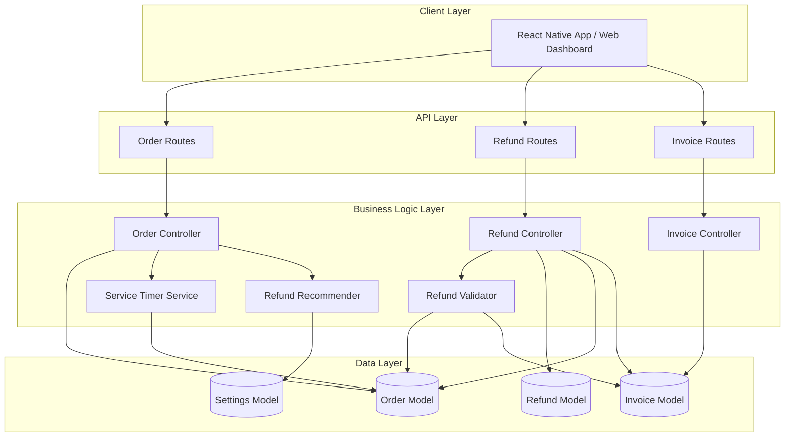

# Design Document: Order Item Details and Refund System

## Overview

This design document specifies the technical implementation for enhancing the Laundry Management System with three core capabilities:

1. **Item Type Categorization and Detailed Item Tracking**: Extends the existing order item schema to capture granular item-level details including item type categories (Clothing, Linen, Accessories, Special Items), specific item names, and individual pricing while maintaining backward compatibility with the existing service-based structure.

2. **Service Time Tracking**: Implements automated time tracking that captures service start time (when order status changes to "washing"), service end time (when status changes to "delivered"), and calculates service duration to enable operational analytics and time-based refund recommendations.

3. **Comprehensive Refund System**: Introduces a flexible refund mechanism supporting both full order refunds and partial item-level refunds, with reason documentation, authorization controls, invoice integration, and automated refund recommendations based on service delays.

The design integrates seamlessly with existing Order, Invoice, and Payment modules, leveraging the current MongoDB schema structure and Express.js API patterns. Currency handling is explicitly excluded from this design as it is already implemented via the Settings module.

### Key Design Principles

- **Backward Compatibility**: Preserve existing order item structure (service reference, serviceName, serviceType) to ensure existing orders remain functional
- **Data Integrity**: Enforce validation rules to prevent invalid refunds (e.g., refunds exceeding original amounts, duplicate refunds)
- **Audit Trail**: Maintain complete history of all refund transactions with user attribution and timestamps
- **Separation of Concerns**: Keep refund logic separate from order and invoice logic while maintaining clear integration points
- **Extensibility**: Design schemas and APIs to accommodate future enhancements (e.g., additional item types, refund approval workflows)

## Architecture

### System Components



### Component Responsibilities

**Order Controller**: Manages order creation, updates, and status transitions. Triggers service time tracking when status changes to "washing" or "delivered". Invokes refund recommender when service duration exceeds thresholds.

**Refund Controller**: Processes full and partial refunds, validates refund requests, creates refund records, updates invoices, and generates refund receipts.

**Service Timer Service**: Calculates service duration based on status history timestamps. Provides utility functions for time calculations and formatting.

**Refund Validator**: Validates refund requests against business rules (amount limits, order status, item existence, duplicate refunds).

**Refund Recommender**: Analyzes service duration against expected thresholds and generates refund recommendations with calculated amounts.

**Refund Model**: Stores refund transaction records with full audit trail.

**Order Model**: Extended to include item type, item name, service time tracking fields, and refund status per item.

**Invoice Model**: Updated to reflect refund line items and recalculated balances.

## Components and Interfaces

### Data Models

#### Extended Order Item Schema

```javascript
const orderItemSchema = new mongoose.Schema({
    // Existing fields (preserved for backward compatibility)
    service: {
        type: mongoose.Schema.Types.ObjectId,
        ref: 'Service',
    },
    serviceName: {
        type: String,
        required: true,
    },
    serviceType: {
        type: String,
        required: true,
    },
    quantity: {
        type: Number,
        required: [true, 'Quantity is required'],
        min: 1,
    },
    unit: {
        type: String,
        enum: ['piece', 'kg', 'bundle'],
        default: 'piece',
    },
    pricePerUnit: {
        type: Number,
        required: true,
        min: 0,
    },
    subtotal: {
        type: Number,
        required: true,
        min: 0,
    },
    
    // NEW FIELDS for item details
    itemType: {
        type: String,
        enum: ['Clothing', 'Linen', 'Accessories', 'Special_Items'],
        required: true,
    },
    itemName: {
        type: String,
        required: true,
        trim: true,
    },
    
    // NEW FIELDS for refund tracking
    isRefunded: {
        type: Boolean,
        default: false,
    },
    refundAmount: {
        type: Number,
        default: 0,
        min: 0,
    },
    refundReason: {
        type: String,
        enum: ['Damaged', 'Lost', 'Delayed_Service', 'Quality_Issue', 'Customer_Complaint', 'Other', null],
        default: null,
    },
    refundReasonDescription: {
        type: String,
        trim: true,
    },
});
```

#### Extended Order Schema

```javascript
const orderSchema = new mongoose.Schema(
    {
        // ... existing fields ...
        
        // NEW FIELDS for service time tracking
        serviceStartTime: {
            type: Date,
            default: null,
        },
        serviceEndTime: {
            type: Date,
            default: null,
        },
        serviceDuration: {
            type: Number, // in hours with 2 decimal precision
            default: null,
        },
        isDelayed: {
            type: Boolean,
            default: false,
        },
        
        // NEW FIELDS for refund tracking
        totalRefundAmount: {
            type: Number,
            default: 0,
            min: 0,
        },
        hasRefund: {
            type: Boolean,
            default: false,
        },
    },
    { timestamps: true }
);
```

#### New Refund Model

```javascript
const refundSchema = new mongoose.Schema(
    {
        refundId: {
            type: String,
            unique: true,
            required: true,
        },
        order: {
            type: mongoose.Schema.Types.ObjectId,
            ref: 'Order',
            required: true,
        },
        invoice: {
            type: mongoose.Schema.Types.ObjectId,
            ref: 'Invoice',
            required: true,
        },
        customer: {
            type: mongoose.Schema.Types.ObjectId,
            ref: 'Customer',
            required: true,
        },
        refundType: {
            type: String,
            enum: ['full', 'partial'],
            required: true,
        },
        totalRefundAmount: {
            type: Number,
            required: true,
            min: 0,
        },
        refundedItems: [{
            orderItemId: {
                type: mongoose.Schema.Types.ObjectId,
                required: true,
            },
            itemName: String,
            itemType: String,
            refundAmount: Number,
            refundReason: {
                type: String,
                enum: ['Damaged', 'Lost', 'Delayed_Service', 'Quality_Issue', 'Customer_Complaint', 'Other'],
                required: true,
            },
            refundReasonDescription: String,
        }],
        fullOrderReason: {
            type: String,
            enum: ['Damaged', 'Lost', 'Delayed_Service', 'Quality_Issue', 'Customer_Complaint', 'Other'],
        },
        fullOrderReasonDescription: String,
        processedBy: {
            type: mongoose.Schema.Types.ObjectId,
            ref: 'User',
            required: true,
        },
        processedByName: String,
        ipAddress: String,
        status: {
            type: String,
            enum: ['pending', 'completed', 'failed'],
            default: 'completed',
        },
        notes: String,
    },
    { timestamps: true }
);

// Auto-generate Refund ID (REF-0001, REF-0002, ...)
refundSchema.pre('save', async function () {
    if (this.isNew) {
        const counter = await RefundCounter.findByIdAndUpdate(
            'refundId',
            { $inc: { seq: 1 } },
            { new: true, upsert: true }
        );
        this.refundId = `REF-${String(counter.seq).padStart(4, '0')}`;
    }
});
```

#### Extended Invoice Schema

```javascript
// Add new fields to existing Invoice schema
const invoiceSchema = new mongoose.Schema(
    {
        // ... existing fields ...
        
        // NEW FIELDS for refund tracking
        refundLineItems: [{
            refund: {
                type: mongoose.Schema.Types.ObjectId,
                ref: 'Refund',
            },
            description: String,
            amount: Number, // negative value
            refundDate: Date,
        }],
        totalRefundAmount: {
            type: Number,
            default: 0,
            min: 0,
        },
        creditBalance: {
            type: Number,
            default: 0,
        },
    },
    { timestamps: true }
);
```

#### Service Duration Threshold Settings

```javascript
// Add to existing Settings schema
const settingsSchema = new mongoose.Schema(
    {
        // ... existing fields ...
        
        // NEW FIELDS for service duration thresholds
        serviceDurationThresholds: {
            type: Map,
            of: Number, // hours
            default: {
                'Wash & Fold': 24,
                'Dry Cleaning': 48,
                'Ironing': 12,
                'Wash & Iron': 24,
            },
        },
        refundRecommendationEnabled: {
            type: Boolean,
            default: true,
        },
    },
    { timestamps: true }
);
```

### API Endpoints

#### Order Endpoints (Extended)

```
POST   /api/orders
  - Create order with item type and item name
  - Request body includes itemType and itemName for each item

GET    /api/orders/:id
  - Returns order with service time tracking fields
  - Response includes serviceStartTime, serviceEndTime, serviceDuration, isDelayed

PATCH  /api/orders/:id/status
  - Update order status
  - Automatically updates serviceStartTime when status changes to "washing"
  - Automatically updates serviceEndTime and calculates serviceDuration when status changes to "delivered"
  - Triggers refund recommendation check if service is delayed
```

#### New Refund Endpoints

```
POST   /api/refunds/full
  - Process full order refund
  - Request body: { orderId, reason, reasonDescription?, refundAmount, notes? }
  - Authorization: admin, manager
  - Returns: refund record and updated invoice

POST   /api/refunds/partial
  - Process partial item-level refund
  - Request body: { orderId, items: [{ itemId, refundAmount, reason, reasonDescription? }], notes? }
  - Authorization: admin, manager
  - Returns: refund record and updated invoice

GET    /api/refunds
  - List all refunds with filters
  - Query params: startDate, endDate, reason, itemType, customerId, processedBy
  - Returns: paginated refund list

GET    /api/refunds/:id
  - Get refund details
  - Returns: refund record with populated order, invoice, customer, and user references

GET    /api/refunds/order/:orderId
  - Get all refunds for a specific order
  - Returns: array of refund records

GET    /api/refunds/reports/analytics
  - Get refund analytics
  - Query params: startDate, endDate
  - Returns: total refunds, refund by reason, refund by item type, refund rate, top refunded items

POST   /api/refunds/:id/receipt
  - Generate refund receipt PDF
  - Returns: PDF file

GET    /api/refunds/recommendations
  - Get pending refund recommendations for delayed orders
  - Authorization: admin, manager
  - Returns: array of orders with refund recommendations
```

#### Invoice Endpoints (Extended)

```
GET    /api/invoices/:id
  - Returns invoice with refund line items
  - Response includes refundLineItems, totalRefundAmount, creditBalance
```

### Service Interfaces

#### Service Timer Service

```javascript
class ServiceTimerService {
    /**
     * Calculate service duration in hours
     * @param {Date} startTime - Service start timestamp
     * @param {Date} endTime - Service end timestamp
     * @returns {Number} Duration in hours with 2 decimal precision
     */
    static calculateDuration(startTime, endTime) {
        if (!startTime || !endTime) return null;
        const durationMs = endTime - startTime;
        const durationHours = durationMs / (1000 * 60 * 60);
        return Math.round(durationHours * 100) / 100;
    }

    /**
     * Format duration for display
     * @param {Number} durationHours - Duration in hours
     * @returns {String} Formatted duration (e.g., "2.5 hours", "In Progress")
     */
    static formatDuration(durationHours) {
        if (durationHours === null) return 'In Progress';
        if (durationHours < 1) return `${Math.round(durationHours * 60)} minutes`;
        return `${durationHours.toFixed(2)} hours`;
    }

    /**
     * Update service time tracking on status change
     * @param {Object} order - Order document
     * @param {String} newStatus - New order status
     * @returns {Object} Updated time tracking fields
     */
    static async updateServiceTime(order, newStatus) {
        const updates = {};
        
        if (newStatus === 'washing' && !order.serviceStartTime) {
            updates.serviceStartTime = new Date();
        }
        
        if (newStatus === 'delivered' && !order.serviceEndTime) {
            updates.serviceEndTime = new Date();
            if (order.serviceStartTime) {
                updates.serviceDuration = this.calculateDuration(
                    order.serviceStartTime,
                    updates.serviceEndTime
                );
            }
        }
        
        return updates;
    }
}
```

#### Refund Validator Service

```javascript
class RefundValidatorService {
    /**
     * Validate full refund request
     * @param {Object} order - Order document
     * @param {Number} refundAmount - Requested refund amount
     * @returns {Object} { valid: Boolean, errors: Array }
     */
    static async validateFullRefund(order, refundAmount) {
        const errors = [];
        
        // Check order status
        if (order.status === 'cancelled') {
            errors.push('Cannot refund cancelled orders');
        }
        
        // Check refund amount
        if (refundAmount > order.totalAmount) {
            errors.push('Refund amount cannot exceed original order amount');
        }
        
        // Check total refunds
        if (order.totalRefundAmount + refundAmount > order.totalAmount) {
            errors.push('Total refunds cannot exceed original order amount');
        }
        
        // Check if invoice exists and has payments
        const invoice = await Invoice.findOne({ order: order._id });
        if (!invoice) {
            errors.push('Invoice not found for this order');
        } else if (invoice.paidAmount === 0) {
            errors.push('Cannot refund order with no payments');
        }
        
        return {
            valid: errors.length === 0,
            errors,
        };
    }

    /**
     * Validate partial refund request
     * @param {Object} order - Order document
     * @param {Array} refundItems - Array of { itemId, refundAmount }
     * @returns {Object} { valid: Boolean, errors: Array }
     */
    static async validatePartialRefund(order, refundItems) {
        const errors = [];
        
        // Check order status
        if (order.status === 'cancelled') {
            errors.push('Cannot refund cancelled orders');
        }
        
        // Validate each item
        for (const refundItem of refundItems) {
            const orderItem = order.items.id(refundItem.itemId);
            
            if (!orderItem) {
                errors.push(`Item ${refundItem.itemId} not found in order`);
                continue;
            }
            
            if (orderItem.isRefunded && orderItem.refundAmount >= orderItem.subtotal) {
                errors.push(`Item ${orderItem.itemName} has already been fully refunded`);
            }
            
            const totalItemRefund = (orderItem.refundAmount || 0) + refundItem.refundAmount;
            if (totalItemRefund > orderItem.subtotal) {
                errors.push(`Refund amount for ${orderItem.itemName} exceeds item subtotal`);
            }
        }
        
        // Check total refunds
        const totalRefundAmount = refundItems.reduce((sum, item) => sum + item.refundAmount, 0);
        if (order.totalRefundAmount + totalRefundAmount > order.totalAmount) {
            errors.push('Total refunds cannot exceed original order amount');
        }
        
        // Check if invoice exists and has payments
        const invoice = await Invoice.findOne({ order: order._id });
        if (!invoice) {
            errors.push('Invoice not found for this order');
        } else if (invoice.paidAmount === 0) {
            errors.push('Cannot refund order with no payments');
        }
        
        return {
            valid: errors.length === 0,
            errors,
        };
    }

    /**
     * Check if order requires admin approval for refund
     * @param {Object} order - Order document
     * @returns {Boolean} True if admin approval required
     */
    static requiresAdminApproval(order) {
        const thirtyDaysAgo = new Date();
        thirtyDaysAgo.setDate(thirtyDaysAgo.getDate() - 30);
        
        return order.serviceEndTime && order.serviceEndTime < thirtyDaysAgo;
    }
}
```

#### Refund Recommender Service

```javascript
class RefundRecommenderService {
    /**
     * Check if order qualifies for refund recommendation
     * @param {Object} order - Order document
     * @param {Object} settings - Settings document
     * @returns {Object|null} Recommendation object or null
     */
    static async generateRecommendation(order, settings) {
        if (!settings.refundRecommendationEnabled) return null;
        if (!order.serviceDuration) return null;
        
        // Get expected duration threshold for service type
        const expectedDuration = settings.serviceDurationThresholds.get(order.items[0]?.serviceType);
        if (!expectedDuration) return null;
        
        const delayPercentage = ((order.serviceDuration - expectedDuration) / expectedDuration) * 100;
        
        // Only recommend if delay exceeds 50%
        if (delayPercentage < 50) return null;
        
        // Calculate recommended refund amount
        let refundPercentage = 10; // 10% for 50-100% delay
        if (delayPercentage > 100) {
            refundPercentage = 20; // 20% for >100% delay
        }
        
        const recommendedAmount = Math.round((order.totalAmount * refundPercentage) / 100);
        
        return {
            orderId: order._id,
            orderNumber: order.orderId,
            customerName: order.customer.name,
            serviceDuration: order.serviceDuration,
            expectedDuration,
            delayPercentage: Math.round(delayPercentage),
            recommendedAmount,
            refundPercentage,
            reason: 'Delayed_Service',
        };
    }

    /**
     * Get all pending refund recommendations
     * @returns {Array} Array of recommendation objects
     */
    static async getPendingRecommendations() {
        const settings = await Settings.findById('global');
        if (!settings.refundRecommendationEnabled) return [];
        
        // Find delivered orders with service duration but no refund
        const orders = await Order.find({
            status: 'delivered',
            serviceDuration: { $ne: null },
            hasRefund: false,
            isDelayed: true,
        }).populate('customer');
        
        const recommendations = [];
        for (const order of orders) {
            const recommendation = await this.generateRecommendation(order, settings);
            if (recommendation) {
                recommendations.push(recommendation);
            }
        }
        
        return recommendations;
    }
}
```

## Data Models

### Order Item Structure

Each order item contains:
- **Existing fields**: service reference, serviceName, serviceType, quantity, unit, pricePerUnit, subtotal
- **New item detail fields**: itemType (enum), itemName (string)
- **New refund tracking fields**: isRefunded (boolean), refundAmount (number), refundReason (enum), refundReasonDescription (string)

### Order Structure

Extended with:
- **Service time tracking**: serviceStartTime, serviceEndTime, serviceDuration, isDelayed
- **Refund tracking**: totalRefundAmount, hasRefund

### Refund Structure

Complete refund transaction record containing:
- **Identification**: refundId (auto-generated), order reference, invoice reference, customer reference
- **Refund details**: refundType (full/partial), totalRefundAmount
- **Item-level details**: refundedItems array with itemId, itemName, itemType, refundAmount, refundReason
- **Full order details**: fullOrderReason, fullOrderReasonDescription
- **Audit trail**: processedBy, processedByName, ipAddress, timestamps
- **Status**: status (pending/completed/failed), notes

### Invoice Structure

Extended with:
- **Refund line items**: refundLineItems array with refund reference, description, amount, refundDate
- **Refund totals**: totalRefundAmount, creditBalance

### Settings Structure

Extended with:
- **Service duration thresholds**: serviceDurationThresholds (Map of serviceType to hours)
- **Refund recommendation toggle**: refundRecommendationEnabled (boolean)


## Correctness Properties

*A property is a characteristic or behavior that should hold true across all valid executions of a system—essentially, a formal statement about what the system should do. Properties serve as the bridge between human-readable specifications and machine-verifiable correctness guarantees.*

### Property Reflection

After analyzing all acceptance criteria, I identified the following redundancies:
- Properties 4.5 and 5.8 both test invoice balance recalculation (same formula)
- Properties 4.2 and 11.2 both test refund amount validation (same constraint)
- Multiple properties test round-trip persistence which can be consolidated

The following properties represent the unique, non-redundant correctness guarantees for this feature:

### Property 1: Item Type Enum Validation

*For any* item type value, the Order_System SHALL accept it if and only if it is one of the valid enum values (Clothing, Linen, Accessories, Special_Items)

**Validates: Requirements 1.1**

### Property 2: Item Type Required Validation

*For any* order item creation attempt without an itemType field, the Order_System SHALL reject the creation with a validation error

**Validates: Requirements 1.2**

### Property 3: Item Details Round-Trip Preservation

*For any* order item created with itemType, itemName, serviceType, quantity, unit, pricePerUnit, and subtotal, retrieving the saved item SHALL return all fields with their original values preserved

**Validates: Requirements 1.3, 1.4, 2.1**

### Property 4: Item Grouping by Type

*For any* order containing multiple items with various itemType values, the grouping function SHALL return items organized into groups where all items in each group share the same itemType

**Validates: Requirements 1.5**

### Property 5: Item Subtotal Calculation

*For any* order item with quantity Q and pricePerUnit P, the calculated subtotal SHALL equal Q × P

**Validates: Requirements 2.2**

### Property 6: Quantity Positive Validation

*For any* order item with quantity less than or equal to zero, the Order_System SHALL reject the item with a validation error

**Validates: Requirements 2.3**

### Property 7: Price Non-Negative Validation

*For any* order item with pricePerUnit less than zero, the Order_System SHALL reject the item with a validation error

**Validates: Requirements 2.4**

### Property 8: Order Subtotal Aggregation

*For any* order containing N items with subtotals S₁, S₂, ..., Sₙ, the order subtotal SHALL equal Σ(S₁ + S₂ + ... + Sₙ)

**Validates: Requirements 2.5**

### Property 9: Service Start Time Recording

*For any* order with status changed to "washing", if serviceStartTime was previously null, then serviceStartTime SHALL be set to the current timestamp

**Validates: Requirements 3.1**

### Property 10: Service End Time Recording

*For any* order with status changed to "delivered", if serviceEndTime was previously null, then serviceEndTime SHALL be set to the current timestamp

**Validates: Requirements 3.2**

### Property 11: Service Duration Calculation

*For any* order with non-null serviceStartTime T₁ and serviceEndTime T₂, the serviceDuration SHALL equal (T₂ - T₁) converted to hours with two decimal precision

**Validates: Requirements 3.3, 3.4**

### Property 12: Refund Amount Limit Validation

*For any* refund request with refundAmount R and order with totalAmount T and existing totalRefundAmount E, the Refund_System SHALL reject the request if R + E > T

**Validates: Requirements 4.2, 11.2**

### Property 13: Full Refund Record Creation

*For any* valid full refund request processed, retrieving the created refund record SHALL return a document containing refundType="full", totalRefundAmount, fullOrderReason, processedBy, and timestamps

**Validates: Requirements 4.3**

### Property 14: Invoice Update on Refund

*For any* refund processed with amount R, the associated invoice SHALL be updated to include a refund line item with amount -R and totalRefundAmount increased by R

**Validates: Requirements 4.4, 5.6, 9.1**

### Property 15: Invoice Balance Recalculation

*For any* invoice with originalAmount O, paidAmount P, and totalRefundAmount R, the balanceDue SHALL equal O - P - R

**Validates: Requirements 4.5, 5.8, 9.4**

### Property 16: Payment Status Update on Full Refund

*For any* order where a refund amount R equals the original totalAmount T, the invoice paymentStatus SHALL be updated to "refunded"

**Validates: Requirements 4.6**

### Property 17: Refund Audit Trail

*For any* refund processed, the order statusHistory SHALL contain an entry with the refund details, timestamp, and processedBy user reference

**Validates: Requirements 4.7, 7.4**

### Property 18: Partial Refund Item Validation

*For any* partial refund request containing an itemId that does not exist in the specified order, the Refund_System SHALL reject the request with a validation error

**Validates: Requirements 5.2**

### Property 19: Item Refund Amount Limit

*For any* partial refund request for an item with subtotal S and existing refundAmount E, if the requested refundAmount R causes E + R > S, the Refund_System SHALL reject the request

**Validates: Requirements 5.3**

### Property 20: Partial Refund Record Creation

*For any* valid partial refund request processed, retrieving the created refund record SHALL return a document containing refundType="partial", refundedItems array with itemId, refundAmount, and refundReason for each item, and totalRefundAmount equal to the sum of all item refund amounts

**Validates: Requirements 5.4, 5.5**

### Property 21: Refunded Item Marking

*For any* item included in a partial refund with refundAmount R, the order item SHALL be updated with isRefunded=true, refundAmount increased by R, and refundReason set to the provided reason

**Validates: Requirements 5.7**

### Property 22: Refund Reason Enum Validation

*For any* refund reason value, the Refund_System SHALL accept it if and only if it is one of the valid enum values (Damaged, Lost, Delayed_Service, Quality_Issue, Customer_Complaint, Other)

**Validates: Requirements 6.1**

### Property 23: Other Reason Description Required

*For any* refund request with refundReason="Other" and no refundReasonDescription provided, the Refund_System SHALL reject the request with a validation error

**Validates: Requirements 6.2**

### Property 24: Refund Reason Preservation

*For any* refund created with a specific refundReason value, retrieving the refund record SHALL return the same refundReason value

**Validates: Requirements 6.3**

### Property 25: Multiple Reasons in Partial Refund

*For any* partial refund containing items I₁, I₂, ..., Iₙ with reasons R₁, R₂, ..., Rₙ where not all reasons are equal, the Refund_System SHALL store each item with its corresponding reason independently

**Validates: Requirements 6.4**

### Property 26: Refund Reason Required Validation

*For any* refund request without a refundReason field, the Refund_System SHALL reject the request with a validation error

**Validates: Requirements 6.5**

### Property 27: Refund Audit Fields Recording

*For any* refund processed by user U from IP address I at time T, the refund record SHALL contain processedBy=U, ipAddress=I, and createdAt=T

**Validates: Requirements 7.3**

### Property 28: Refund Receipt Generation

*For any* refund record, generating a receipt SHALL produce a document containing refundId, orderId, customer details, refunded items or full order indicator, totalRefundAmount, refundReason, processedBy user name, and refund date

**Validates: Requirements 7.5**

### Property 29: Refund Rate Calculation

*For any* set of orders with total amount T and refunds with total amount R, the refund rate SHALL equal (R / T) × 100

**Validates: Requirements 8.2**

### Property 30: Refund Report Filtering

*For any* refund report filtered by criteria C (date range, reason, itemType, customer, or processedBy), the returned results SHALL contain only refunds matching all specified criteria in C

**Validates: Requirements 8.3**

### Property 31: Top Refunded Items Calculation

*For any* set of refunds, the top refunded items by frequency SHALL be the items appearing most often in refunds, and by amount SHALL be the items with highest total refund amounts

**Validates: Requirements 8.4**

### Property 32: Invoice Refund Line Item Structure

*For any* refund line item added to an invoice, the line item SHALL contain description, amount (negative value), and refundDate fields

**Validates: Requirements 9.2**

### Property 33: Invoice Total Recalculation

*For any* invoice with originalAmount O and totalRefundAmount R, the recalculated totalAmount SHALL equal O - R

**Validates: Requirements 9.3**

### Property 34: Credit Balance Display

*For any* invoice where balanceDue is negative with value -C, the displayed balance SHALL show "Credit Balance: C" with positive value

**Validates: Requirements 9.5**

### Property 35: Payment Status Update Rules

*For any* invoice with refund, the paymentStatus SHALL be "refunded" if totalRefundAmount equals originalAmount, "partial" if balanceDue is positive, or "paid" if balanceDue is zero or negative but totalRefundAmount is less than originalAmount

**Validates: Requirements 9.6**

### Property 36: Delayed Order Flagging

*For any* order with serviceDuration D and expected threshold T for its service type, if D > T × 1.5, the order SHALL be flagged with isDelayed=true

**Validates: Requirements 10.2**

### Property 37: Refund Recommendation Amount Calculation

*For any* delayed order with serviceDuration D and expected threshold T, if 1.5T < D ≤ 2T, the recommended refund amount SHALL be 10% of totalAmount, and if D > 2T, the recommended refund amount SHALL be 20% of totalAmount

**Validates: Requirements 10.4**

### Property 38: Cancelled Order Refund Prevention

*For any* refund request for an order with status="cancelled", the Refund_System SHALL reject the request with a validation error

**Validates: Requirements 11.1**

### Property 39: Fully Refunded Item Prevention

*For any* partial refund request for an item where isRefunded=true and refundAmount equals subtotal, the Refund_System SHALL reject the request with a validation error

**Validates: Requirements 11.3**

### Property 40: Unpaid Order Refund Prevention

*For any* refund request for an order whose invoice has paidAmount=0, the Refund_System SHALL reject the request with a validation error

**Validates: Requirements 11.5**

### Property 41: Credit Balance Application

*For any* customer with creditBalance C > 0 creating a new order with totalAmount T, the system SHALL allow applying up to min(C, T) from the credit balance to the new order

**Validates: Requirements 12.5**

## Error Handling

### Validation Errors

The system implements comprehensive validation at multiple layers:

**Schema-Level Validation** (Mongoose):
- Required field validation (itemType, itemName, quantity, pricePerUnit, refundReason)
- Enum validation (itemType, unit, refundReason, refundType, status)
- Numeric range validation (quantity > 0, pricePerUnit >= 0, refundAmount >= 0)
- String format validation (trim whitespace, length limits)

**Business Logic Validation** (RefundValidatorService):
- Refund amount limits (cannot exceed original amount or item subtotal)
- Order status validation (cannot refund cancelled orders)
- Item existence validation (item must exist in order)
- Duplicate refund prevention (cannot refund already fully refunded items)
- Payment validation (cannot refund unpaid orders)
- Time-based validation (admin approval required for orders delivered >30 days ago)

**Error Response Format**:
```javascript
{
    success: false,
    error: {
        code: 'VALIDATION_ERROR' | 'BUSINESS_RULE_VIOLATION' | 'NOT_FOUND' | 'UNAUTHORIZED',
        message: 'Human-readable error message',
        details: ['Specific validation error 1', 'Specific validation error 2'],
        field: 'fieldName', // for field-specific errors
    }
}
```

### Error Scenarios and Handling

**Order Creation Errors**:
- Missing required fields → 400 Bad Request with field details
- Invalid itemType enum → 400 Bad Request with valid options
- Negative quantity or price → 400 Bad Request with validation message
- Customer not found → 404 Not Found

**Status Update Errors**:
- Invalid status transition → 400 Bad Request with allowed transitions
- Order not found → 404 Not Found
- Unauthorized user → 403 Forbidden

**Refund Processing Errors**:
- Refund amount exceeds limit → 400 Bad Request with maximum allowed amount
- Order status is cancelled → 400 Bad Request with explanation
- Item not found in order → 404 Not Found with valid item IDs
- Item already fully refunded → 400 Bad Request with refund history
- No payments made → 400 Bad Request with payment requirement
- Missing refund reason → 400 Bad Request with required field
- "Other" reason without description → 400 Bad Request with requirement
- Unauthorized role → 403 Forbidden
- Admin approval required → 403 Forbidden with approval requirement message

**Invoice Update Errors**:
- Invoice not found → 404 Not Found
- Concurrent update conflict → 409 Conflict with retry suggestion
- Calculation overflow → 500 Internal Server Error with error tracking

**Database Errors**:
- Connection failure → 503 Service Unavailable with retry-after header
- Duplicate key violation → 409 Conflict
- Transaction failure → 500 Internal Server Error with rollback confirmation

### Error Recovery Strategies

**Transactional Integrity**:
- Use MongoDB transactions for refund processing to ensure atomicity
- If refund record creation succeeds but invoice update fails, rollback refund
- If invoice update succeeds but order update fails, rollback both
- Log all transaction failures for manual review

**Idempotency**:
- Refund operations are idempotent using refundId
- Duplicate refund requests with same refundId return existing refund
- Status updates check current status before applying changes

**Graceful Degradation**:
- If notification service fails, refund still processes but logs warning
- If receipt generation fails, refund still processes but receipt can be regenerated
- If analytics calculation fails, core refund functionality remains operational

**Retry Logic**:
- Automatic retry for transient database errors (max 3 attempts with exponential backoff)
- No automatic retry for validation errors or business rule violations
- Client-side retry guidance in error responses

## Testing Strategy

This feature requires a comprehensive testing approach combining property-based testing for core business logic with example-based unit tests for specific scenarios and integration tests for system interactions.

### Property-Based Testing

**Framework**: Use `fast-check` for JavaScript/Node.js property-based testing

**Configuration**: Each property test MUST run minimum 100 iterations to ensure comprehensive input coverage

**Test Organization**: Property tests are organized by domain (Order Items, Service Timing, Refunds, Invoices)

**Property Test Examples**:

```javascript
// Property 5: Item Subtotal Calculation
describe('Property 5: Item Subtotal Calculation', () => {
    it('for any quantity and pricePerUnit, subtotal equals quantity × pricePerUnit', () => {
        // Feature: order-item-details-and-refund-system, Property 5
        fc.assert(
            fc.property(
                fc.integer({ min: 1, max: 1000 }), // quantity
                fc.float({ min: 0, max: 10000, noNaN: true }), // pricePerUnit
                (quantity, pricePerUnit) => {
                    const item = {
                        quantity,
                        pricePerUnit,
                        subtotal: quantity * pricePerUnit,
                    };
                    const calculated = calculateItemSubtotal(item);
                    expect(calculated).toBeCloseTo(quantity * pricePerUnit, 2);
                }
            ),
            { numRuns: 100 }
        );
    });
});

// Property 12: Refund Amount Limit Validation
describe('Property 12: Refund Amount Limit Validation', () => {
    it('rejects refund if refundAmount + existing refunds > totalAmount', () => {
        // Feature: order-item-details-and-refund-system, Property 12
        fc.assert(
            fc.property(
                fc.float({ min: 100, max: 10000 }), // totalAmount
                fc.float({ min: 0, max: 5000 }), // existingRefunds
                fc.float({ min: 0, max: 10000 }), // requestedRefund
                async (totalAmount, existingRefunds, requestedRefund) => {
                    const order = await createTestOrder({ totalAmount, totalRefundAmount: existingRefunds });
                    const validation = await RefundValidatorService.validateFullRefund(order, requestedRefund);
                    
                    if (requestedRefund + existingRefunds > totalAmount) {
                        expect(validation.valid).toBe(false);
                        expect(validation.errors).toContain('Total refunds cannot exceed original order amount');
                    } else {
                        expect(validation.valid).toBe(true);
                    }
                }
            ),
            { numRuns: 100 }
        );
    });
});

// Property 15: Invoice Balance Recalculation
describe('Property 15: Invoice Balance Recalculation', () => {
    it('balanceDue equals originalAmount - paidAmount - totalRefundAmount', () => {
        // Feature: order-item-details-and-refund-system, Property 15
        fc.assert(
            fc.property(
                fc.float({ min: 100, max: 10000 }), // originalAmount
                fc.float({ min: 0, max: 10000 }), // paidAmount
                fc.float({ min: 0, max: 5000 }), // totalRefundAmount
                async (originalAmount, paidAmount, totalRefundAmount) => {
                    const invoice = await createTestInvoice({
                        totalAmount: originalAmount,
                        paidAmount,
                        totalRefundAmount,
                    });
                    
                    await invoice.save();
                    const expected = originalAmount - paidAmount - totalRefundAmount;
                    expect(invoice.balanceDue).toBeCloseTo(expected, 2);
                }
            ),
            { numRuns: 100 }
        );
    });
});
```

**Generator Strategies**:
- **Order Items**: Generate random itemType (from enum), itemName (alphanumeric strings), quantity (1-1000), pricePerUnit (0-10000)
- **Service Times**: Generate random timestamps with realistic intervals (hours to days)
- **Refund Amounts**: Generate amounts relative to order totals (0-100% of total)
- **Refund Reasons**: Generate from enum values, with "Other" requiring description
- **Edge Cases**: Include boundary values (0, negative, very large numbers), null values, empty strings

### Unit Testing

**Focus Areas**:
- Specific validation scenarios (empty itemName, invalid enum values)
- Edge cases (zero quantity, negative prices, null timestamps)
- Error message formatting
- Helper function behavior (duration formatting, grouping logic)
- Status transition logic

**Example Unit Tests**:

```javascript
describe('Order Item Validation', () => {
    it('rejects item with empty itemName', async () => {
        const item = { itemType: 'Clothing', itemName: '', quantity: 1, pricePerUnit: 10 };
        await expect(createOrderItem(item)).rejects.toThrow('Item name is required');
    });
    
    it('rejects item with invalid itemType', async () => {
        const item = { itemType: 'InvalidType', itemName: 'Shirt', quantity: 1, pricePerUnit: 10 };
        await expect(createOrderItem(item)).rejects.toThrow('Invalid item type');
    });
});

describe('Service Timer Formatting', () => {
    it('formats duration less than 1 hour as minutes', () => {
        expect(ServiceTimerService.formatDuration(0.5)).toBe('30 minutes');
    });
    
    it('formats null duration as "In Progress"', () => {
        expect(ServiceTimerService.formatDuration(null)).toBe('In Progress');
    });
    
    it('formats duration >= 1 hour with 2 decimal places', () => {
        expect(ServiceTimerService.formatDuration(2.5)).toBe('2.50 hours');
    });
});

describe('Refund Validator', () => {
    it('requires admin approval for orders delivered >30 days ago', () => {
        const order = { serviceEndTime: new Date('2024-01-01') };
        expect(RefundValidatorService.requiresAdminApproval(order)).toBe(true);
    });
    
    it('does not require admin approval for recent orders', () => {
        const order = { serviceEndTime: new Date() };
        expect(RefundValidatorService.requiresAdminApproval(order)).toBe(false);
    });
});
```

### Integration Testing

**Focus Areas**:
- API endpoint behavior (authentication, authorization, request/response format)
- Database transactions (refund processing atomicity)
- Invoice updates triggered by refunds
- Order status history updates
- Notification sending
- Report generation and export
- UI rendering of refund information

**Example Integration Tests**:

```javascript
describe('POST /api/refunds/full', () => {
    it('processes full refund and updates invoice', async () => {
        const order = await createTestOrder({ totalAmount: 1000 });
        const invoice = await createTestInvoice({ order: order._id, totalAmount: 1000, paidAmount: 1000 });
        
        const response = await request(app)
            .post('/api/refunds/full')
            .set('Authorization', `Bearer ${managerToken}`)
            .send({
                orderId: order._id,
                reason: 'Damaged',
                refundAmount: 1000,
            });
        
        expect(response.status).toBe(201);
        expect(response.body.refund.totalRefundAmount).toBe(1000);
        
        const updatedInvoice = await Invoice.findById(invoice._id);
        expect(updatedInvoice.totalRefundAmount).toBe(1000);
        expect(updatedInvoice.paymentStatus).toBe('refunded');
    });
    
    it('rejects refund from unauthorized user', async () => {
        const order = await createTestOrder({ totalAmount: 1000 });
        
        const response = await request(app)
            .post('/api/refunds/full')
            .set('Authorization', `Bearer ${cashierToken}`)
            .send({
                orderId: order._id,
                reason: 'Damaged',
                refundAmount: 1000,
            });
        
        expect(response.status).toBe(403);
    });
});

describe('Order Status Update with Service Timing', () => {
    it('records serviceStartTime when status changes to washing', async () => {
        const order = await createTestOrder({ status: 'received' });
        
        const response = await request(app)
            .patch(`/api/orders/${order._id}/status`)
            .set('Authorization', `Bearer ${managerToken}`)
            .send({ status: 'washing' });
        
        expect(response.status).toBe(200);
        expect(response.body.order.serviceStartTime).toBeDefined();
    });
    
    it('calculates serviceDuration when status changes to delivered', async () => {
        const order = await createTestOrder({
            status: 'washing',
            serviceStartTime: new Date(Date.now() - 24 * 60 * 60 * 1000), // 24 hours ago
        });
        
        const response = await request(app)
            .patch(`/api/orders/${order._id}/status`)
            .set('Authorization', `Bearer ${managerToken}`)
            .send({ status: 'delivered' });
        
        expect(response.status).toBe(200);
        expect(response.body.order.serviceEndTime).toBeDefined();
        expect(response.body.order.serviceDuration).toBeCloseTo(24, 1);
    });
});
```

### Test Coverage Goals

- **Property-Based Tests**: Cover all 41 correctness properties with minimum 100 iterations each
- **Unit Tests**: Achieve 90%+ code coverage for service classes and utility functions
- **Integration Tests**: Cover all API endpoints and critical user workflows
- **Edge Case Coverage**: Test boundary conditions, null values, empty collections, concurrent operations
- **Error Path Coverage**: Test all validation errors and business rule violations

### Test Data Management

- Use factory functions to generate test orders, invoices, refunds with realistic data
- Use database transactions in tests to ensure isolation
- Clean up test data after each test suite
- Use separate test database to avoid affecting development data
- Mock external services (notifications, payment gateways) in unit and integration tests

### Continuous Testing

- Run property-based tests on every commit (CI/CD pipeline)
- Run full integration test suite before deployment
- Monitor property test failures for regression detection
- Track test execution time and optimize slow tests
- Generate test coverage reports and enforce minimum thresholds

